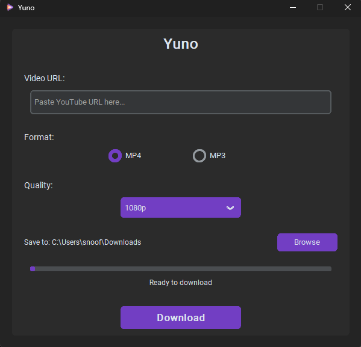

<div align="center">


A modern, lightweight YouTube downloader. Download videos in up to 4K quality or extract audio in MP3 format.

</div>

## 📸 Screenshots



## ✨ Features

### Video Downloads (MP4)
- **1080p** - Full HD quality
- **2K (1440p)** - Quad HD quality  
- **4K (2160p)** - Ultra HD quality
- Audio automatically converted to AAC for universal compatibility

### Audio Downloads (MP3)
- **192 kbps** - Standard quality
- **320 kbps** - High quality

### User Interface
- 🎨 Modern dark theme with custom purple accent color
- 📁 Custom download location selector
- 🖼️ Custom window icon support
- 💻 Clean, minimal interface

## 🛠️ Built With

- **[Python 3.14+](https://www.python.org/)** - Core programming language
- **[CustomTkinter](https://github.com/TomSchimansky/CustomTkinter)** - Modern UI framework
- **[yt-dlp](https://github.com/yt-dlp/yt-dlp)** - YouTube video/audio downloader
- **[FFmpeg](https://ffmpeg.org/)** - Audio/video processing

## 🎯 Usage

1. Launch Yuno
2. Paste a YouTube URL in the text field
3. Select format: **MP4** (video) or **MP3** (audio only)
4. Choose your desired quality
5. Click **Download**

## 🚀 Quick Start

### Download Pre-built Executable

1. Download the latest release from the [Releases](../../releases) page
2. Extract the ZIP file
3. Run `Yuno.exe` - no installation needed!

**Note:** The FFmpeg folder and .ico file must stay in the same directory as `Yuno.exe`

## 💻 Development Setup

### Prerequisites
- Python 3.14 or higher
- Git (optional)

### Installation

1. **Clone or download the repository:**
```powershell
git clone https://github.com/andreitakacs06/yuno.git
cd yuno
```

2. **Create a virtual environment:**
```powershell
python -m venv venv
.\venv\Scripts\Activate.ps1
```

3. **Install Python dependencies:**
```powershell
pip install -r requirements.txt
```

4. **Install FFmpeg (Required):**
```powershell
# Download FFmpeg
Invoke-WebRequest -Uri "https://github.com/BtbN/FFmpeg-Builds/releases/download/latest/ffmpeg-master-latest-win64-gpl.zip" -OutFile "ffmpeg.zip"

# Extract
Expand-Archive -Path "ffmpeg.zip" -DestinationPath "." -Force


5. **Run the application:**
```powershell
python main.py
```

## 📝 License

This project is open source and available for personal use.

## 🤝 Contributing

Contributions, issues, and feature requests are welcome!

## ⚠️ Disclaimer

This tool is for personal use only. Please respect YouTube's Terms of Service and copyright laws. Only download content you have the right to download.

---

<div align="center">
Made with ❤️ by GOsphere Devs
</div>

